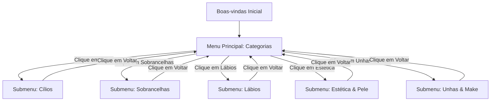

# Documento de Design: Redirecionamento da Consultoria IA para Studiobeauty
> **Data:** 2026-05-20  
> **Status:** Aprovado  
> **Autor:** Antigravity AI  

Este documento registra a arquitetura do **Portal de Conhecimento Dinâmico do Studiobeauty**, redefinindo o antigo chatbot focado em Lash & Brow para um ecossistema de beleza modular que atende às áreas de Cílios (Lash), Sobrancelhas (Brows), Lábios (Lips), Estética Facial (Skincare), e fornece base de conhecimento para Unhas (Nails) e Maquiagem (Makeup).

---

## 1. Objetivos do Sistema

### Objetivos Técnicos
1. **Navegação Dinâmica (Submenus):** Modificar a interface de chips rápidos no chatbot (`ia-consultoria.js`) para suportar navegação aninhada de categorias sem recarregar a página.
2. **Ampliação da Inteligência Semântica:** Adicionar intenções de busca robustas mapeando palavras-chave específicas de Extensões, Lash Lifting, Estética, Biossegurança de Unhas e Maquiagem.
3. **Estrutura de Dados Modular:** Organizar os arquivos de suporte (`kit_lips_knowledge_base.md` e `kit_lips_knowledge_base.json`) para unificar o portfólio do Studiobeauty em tópicos distintos e limpos.

### Objetivos de Negócio
1. **Autoridade Científica Multidisciplinar:** Posicionar o Studiobeauty como um centro de excelência em múltiplas especialidades, aumentando a confiança e atração de clientes.
2. **Vendas Cruzadas (Cross-selling):** Ensinar através da IA a combinação inteligente de produtos (ex: Butter labial acalmando sobrancelhas pós-design, Sérum e Butter na preparação de maquiagem duradoura).
3. **Direcionamento Comercial:** Canalizar compras para o site oficial `www.lashshopbrasil.com.br` com o cupom `LIPS10`.

---

## 2. Arquitetura da Interface do Usuário (UI) e Fluxo de Navegação

A interface de sugestões rápidas (chips) no chatbot funcionará por máquina de estados locais na memória do JavaScript.

### Estados de Navegação de Chips



### Configuração de Menus e Submenus no JS

Os chips serão modelados de forma estruturada dentro do arquivo `ia-consultoria.js`:

```javascript
const navigationMenus = {
    main: [
        { text: "👁️ Cílios", action: "submenu", target: "cilios" },
        { text: "✨ Sobrancelhas", action: "submenu", target: "sobrancelhas" },
        { text: "💋 Lábios", action: "submenu", target: "labios" },
        { text: "🧴 Estética & Pele", action: "submenu", target: "estetica" },
        { text: "💅 Unhas & Make", action: "submenu", target: "unhas_make" },
        { text: "💰 Desconto & Compras", action: "query", query: "preço" }
    ],
    cilios: [
        { text: "👁️ O que é Lash Lifting?", action: "query", query: "lash_lifting" },
        { text: "✨ Volume Russo vs. Brasileiro", action: "query", query: "extension_cilios" },
        { text: "🧴 Máscara Lash Filler 3D", action: "query", query: "lash_filler" },
        { text: "🧼 Como higienizar os cílios", action: "query", query: "higienizar_cilios" },
        { text: "🔙 Menu Principal", action: "submenu", target: "main" }
    ],
    sobrancelhas: [
        { text: "🧴 Modelador Balm Fix", action: "query", query: "balm_fix" },
        { text: "🌿 Design com Henna", action: "query", query: "design_henna" },
        { text: "💫 O que é Brow Lamination?", action: "query", query: "brow_lamination" },
        { text: "🍦 Butter nas Sobrancelhas", action: "query", query: "butter_sobrancelhas" },
        { text: "🔙 Menu Principal", action: "submenu", target: "main" }
    ],
    labios: [
        { text: "💋 Técnicas de Lips Design", action: "query", query: "lips_design" },
        { text: "✨ Spa dos Lábios Avançado", action: "query", query: "spa" },
        { text: "🧪 Ingredientes & Ativos Nobres", action: "query", query: "ingredientes" },
        { text: "🍦 Sabores do Gloss Labial", action: "query", query: "gloss" },
        { text: "🔙 Menu Principal", action: "submenu", target: "main" }
    ],
    estetica: [
        { text: "🧼 Limpeza com Total Care", action: "query", query: "total_care" },
        { text: "💆 Passos da Limpeza de Pele", action: "query", query: "limpeza_pele" },
        { text: "🧴 Skincare Diário Científico", action: "query", query: "skincare" },
        { text: "🔙 Menu Principal", action: "submenu", target: "main" }
    ],
    unhas_make: [
        { text: "💅 Unhas em Gel & Fibra", action: "query", query: "unhas_gel" },
        { text: "🧼 Biossegurança na Manicure", action: "query", query: "unhas_seguranca" },
        { text: "💄 Make de Alta Durabilidade", action: "query", query: "preparacao_make" },
        { text: "🔙 Menu Principal", action: "submenu", target: "main" }
    ]
};
```

---

## 3. Estrutura e Expansão da Inteligência de Resposta (Engine Semântica)

A inteligência semântica local baseada em palavras-chave e pontuação de relevância será estendida com novas intenções completas. As respostas integradas no JS incluirão:

1. **`lash_lifting` / `extension_cilios`:** Explicação rica sobre alongamento de cílios, a diferença de efeitos visuais e o cuidado necessário para aumentar a retenção da cola. Nutrição das hastes com a Máscara Lash Filler.
2. **`brow_lamination` / `design_henna`:** Orientações sobre o alinhamento químico dos pelos e técnicas para garantir o tingimento perfeito da Henna. Uso do modelador Balm Fix para manutenção em casa.
3. **`total_care` / `limpeza_pele`:** Protocolo de higienização celular profunda com a Espuma de Limpeza TOTAL CARE, otimizando tratamentos estéticos subsequentes.
4. **`unhas_gel` / `unhas_seguranca`:** Dicas de alongamento de unhas em gel e fibra de vidro, reforçando a importância do uso de EPIs, esterilização adequada (biossegurança) e cuidados para evitar infiltrações fúngicas.
5. **`preparacao_make`:** A técnica de blindagem de pele pré-maquiagem usando o Sérum Coco Boost e a Butter do Studiobeauty para preenchimento de linhas e fixação extrema de bases em noivas e formandas.

---

## 4. Plano de Testes e Validação

1. **Validação de Sintaxe Local:** Rodar `node -c js/ia-consultoria.js` para garantir integridade estrutural absoluta antes do deploy.
2. **Testes de Navegação do Usuário:** Validar que ao clicar em cada botão de categoria no chat, as sugestões se atualizem de forma responsiva sem causar erros no console.
3. **Testes Semânticos de Fallback:** Digitar termos livres relacionados a unhas, maquiagem e pele para certificar que a engine semântica retorne a resposta correta em vez do fallback genérico.
4. **Deploy de Produção:** Publicar na CDN do Firebase Hosting (`firebase deploy`) e certificar o funcionamento online em produção.
